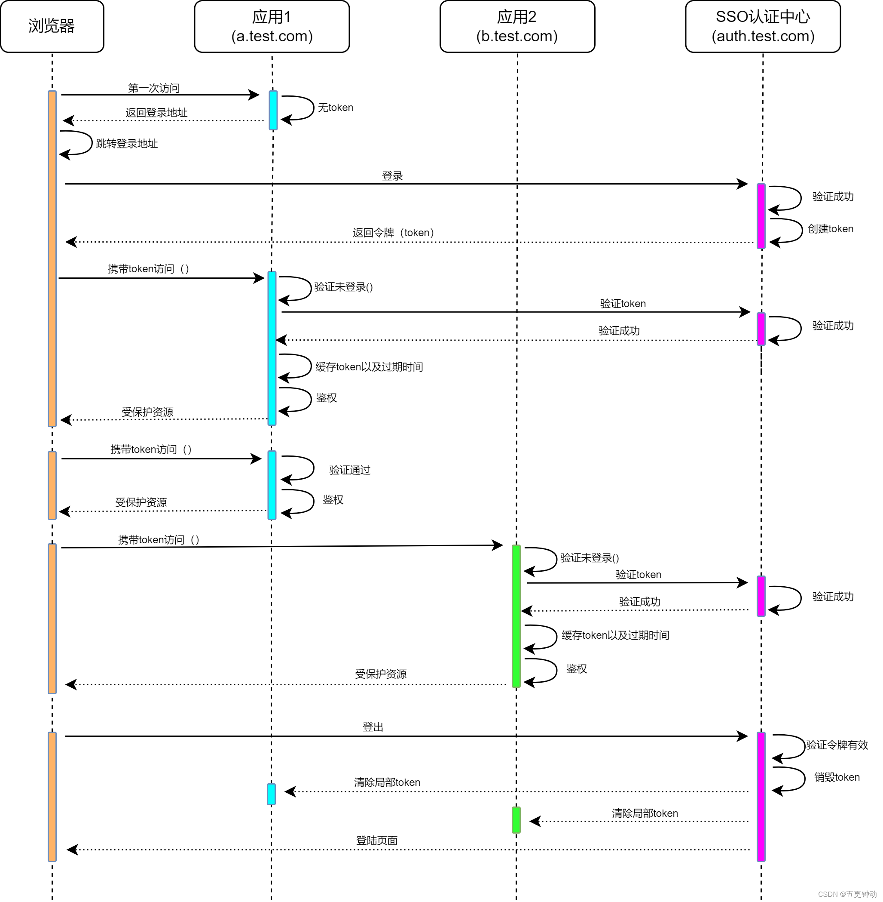

# SSO

## 简介

单点登录（Single Sign-On，简称SSO） 是一种身份验证和授权机制，旨在让用户只需一次登录，就能够访问多个相关但独立的系统或应用。

淘宝和天猫是两个典型的电商平台，它们采用了单点登录（SSO）机制，让用户能够方便快捷地在这两个平台间切换而无需重新登录。用户首次登录淘宝，完成登录后，可以在不再输入账号和密码的情况下访问天猫。这种SSO机制使用户在淘宝和天猫之间实现无缝切换，提升了用户体验。

## 实现方式

### 基于Cookie实现单点登录

Cookie-Based SSO是指使用Cookie来实现单点登录功能的一种方式。其原理是，在用户第一次登录系统时，系统会为用户颁发一个令牌（Token）。这个令牌包含了用户身份信息和过期时间等元数据，并在服务器端保存副本。然后，系统将这个令牌放入响应的Cookie中返回给客户端浏览器，并在后续的每个请求中都携带这个Cookie。当用户访问其他应用系统时，这些系统会验证Cookie中的令牌信息，如果令牌有效，则允许用户访问系统资源。

优点

- 实现简单：Cookie-Based SSO实现起来比较简单，不需要大量的代码。仅需要在用户登录时颁发令牌，并在每个请求中验证Cookie即可。
可扩展性好：可以很容易地添加新的应用系统，只需要验证Cookie中的令牌即可。

缺点

- 安全性低：Cookie-Based SSO是基于Cookie实现的，Cookie可能会被盗用或者伪造。如果攻击者获取了有效的Cookie，则可以冒充用户身份，并访问被授权的系统资源。
- 用户体验差：用户第一次登录时需要输入用户名和密码，并为每个系统都颁发一个Cookie。这样会增加用户的操作量，并且在使用多个浏览器或清理Cookie时可能会造成登录状态失效的问题。
- 难以处理跨域问题：Cookie-Based SSO只适用于同一域名下的应用程序，对于不同域名之间的系统无法实现单点登录。

### 基于token实现单点登录

​ Token-Based SSO是指使用Token来实现单点登录功能的一种方式。其原理是，用户首先在认证服务器上进行身份验证，如果验证成功，则认证服务器会颁发一个Token。然后，这个Token会被发送到客户端浏览器，并通过HTTP请求携带在请求头中或者以参数的形式传递给其他应用系统。当用户访问其他应用系统时，这些系统会向认证服务器验证Token，如果Token有效，则允许用户访问系统资源。

优点

- 安全性高：Token-Based SSO使用Token来实现用户身份认证，Token本身是无法被伪造的，并且可以通过加密和签名等手段进一步加强安全性，可以有效防止Cookie劫持和伪造攻击。
- 用户体验好：用户只需要进行一次身份验证，并获得一个Token即可访问所有被授权的系统资源，不需要多次输入用户名和密码。同时，用户可以在任何时间清除应用系统保存的Token，以保护自身安全。
- 易于处理跨域问题：Token-Based SSO不依赖Cookie，因此可以很容易地处理跨域问题。

缺点

- 实现复杂：Token-Based SSO需要在认证服务器上实现用户身份验证、令牌颁发和Token验证等逻辑。这些逻辑可能比较复杂，需要一定的技术能力。
- 维护成本高：认证服务器需要长期维护和管理，才能保证系统的正常运行。另外，如果有多个应用系统需要接入SSO，还需要在每个系统中添加相应的Token验证逻辑，增加了维护成本。

## 单点登录原理

