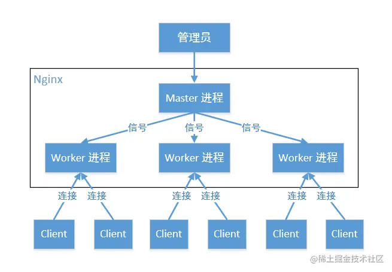
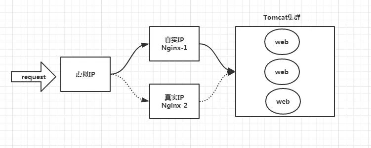

### nginx

## 1.正向代理与反向代理

反向代理（Reverse Proxy）方式是指以代理服务器来接受internet上的连接请求，然后将请求转发给内部网络上的服务器，并将从服务器上得到的结果返回给internet上请求连接的客户端，此时代理服务器对外就表现为一个服务器。

举个例子，比如我想访问<http://www.test.com/readme>，但www.test.com上并不存在readme页面，于是他是偷偷从另外一台服务器上取回来，然后作为自己的内容返回用户，但用户并不知情。这里所提到的 www.test.com 这个域名对应的服务器就设置了反向代理功能。

结论就是，反向代理服务器对于客户端而言它就像是原始服务器，并且客户端不需要进行任何特别的设置。客户端向反向代理的命名空间(name-space)中的内容发送普通请求，接着反向代理服务器将判断向何处(原始服务器)转交请求，并将获得的内容返回给客户端，就像这些内容原本就是它自己的一样。

正向代理，既然有反向代理，就肯定有正向代理。什么叫正向代理呢？

正向代理（Forward Proxy）通常都被简称为代理，就是在用户无法正常访问外部资源，比方说受到GFW的影响无法访问twitter的时候，我们可以通过代理的方式，让用户绕过防火墙，从而连接到目标网络或者服务。

正向代理的工作原理就像一个跳板，比如：我访问不了google.com，但是我能访问一个代理服务器A，A能访问google.com，于是我先连上代理服务器A，告诉他我需要google.com的内容，A就去取回来，然后返回给我。从网站的角度，只在代理服务器来取内容的时候有一次记录，有时候并不知道是用户的请求，也隐藏了用户的资料，这取决于代理告不告诉网站。

## 2.原理

Nginx 启动之后，在 Linux 系统中有两个进程，一个为 master，一个为 worker。master 作为管理员不参与任何工作，只负责给多个 worker 分配不同的任务（worker 一般有多个）。

    Master进程的作用是？
    读取并验证配置文件nginx.conf；管理worker进程；
    Worker进程的作用是？
    每一个Worker进程都维护一个线程（避免线程切换），处理连接和请求；注意Worker进程的个数由配置文件决定，一般和CPU个数相关（有利于进程切换），配置几个就有几个Worker进程。

    Nginx如何做到热部署？
    所谓热部署，就是配置文件nginx.conf修改后，不需要stop Nginx，不需要中断请求，就能让配置文件生效！（nginx -s reload 重新加载/nginx -t检查配置/nginx -s stop）
    通过上文我们已经知道worker进程负责处理具体的请求，那么如果想达到热部署的效果，可以想象：
    方案一：
    修改配置文件nginx.conf后，主进程master负责推送给woker进程更新配置信息，woker进程收到信息后，更新进程内部的线程信息。
    方案二：
    修改配置文件nginx.conf后，重新生成新的worker进程，当然会以新的配置进行处理请求，而且新的请求必须都交给新的worker进程，至于老的worker进程，等把那些以前的请求处理完毕后，kill掉即可。
    Nginx采用方案二

    Nginx如何做到高并发下的高效处理？
    上文已经提及Nginx的worker进程个数与CPU绑定、worker进程内部包含一个线程高效回环处理请求，这的确有助于效率，但这是不够的。
    作为专业的程序员，我们可以开一下脑洞：BIO/NIO/AIO、异步/同步、阻塞/非阻塞...
    要同时处理那么多的请求，要知道，有的请求需要发生IO，可能需要很长时间，如果等着它，就会拖慢worker的处理速度。
    Nginx采用了Linux的epoll模型，epoll模型基于事件驱动机制，它可以监控多个事件是否准备完毕，如果OK，那么放入epoll队列中，这个过程是异步的。worker只需要从epoll队列循环处理即可。

    Nginx挂了怎么办？
    Nginx既然作为入口网关，很重要，如果出现单点问题，显然是不可接受的。
    答案是：Keepalived+Nginx实现高可用。
    Keepalived是一个高可用解决方案，主要是用来防止服务器单点发生故障，可以通过和Nginx配合来实现Web服务的高可用。（其实，Keepalived不仅仅可以和Nginx配合，还可以和很多其他服务配合）
    Keepalived+Nginx实现高可用的思路：
    第一：请求不要直接打到Nginx上，应该先通过Keepalived（这就是所谓虚拟IP，VIP）
    第二：Keepalived应该能监控Nginx的生命状态（提供一个用户自定义的脚本，定期检查Nginx进程状态，进行权重变化,，从而实现Nginx故障切换）

nginx配置https://www.cnblogs.com/hanease/p/15890509.html