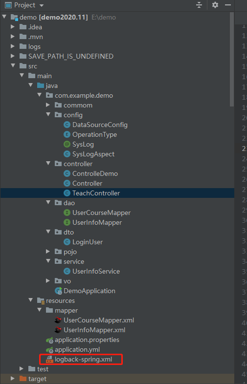

spring-boot-starter中就已经包含了有关slf4j的jar包

### 基础使用
```
import lombok.extern.slf4j.Slf4j;
import org.slf4j.Logger;
import org.slf4j.LoggerFactory;
import org.springframework.beans.factory.annotation.Autowired;

@RestController
@CrossOrigin
@Slf4j
public class TeachController {

    Logger logger = LoggerFactory.getLogger(getClass());

    @Autowired
    private UserInfoService userInfoService;

    /**
     * 1.用户登录
     */
    @RequestMapping(value = "/loginSystem", method = RequestMethod.GET)
    public Result loginSystem(@RequestBody LoginUser loginUser){
        logger.info("进入loginSystem方法：" + loginUser.toString()); //定义的logger变量
        log.info("进入方法2：" + loginUser.toString()); //@Slf4j日志
        return userInfoService.loginOnSystem(loginUser);
    }
}
```

### 定义一个springboot的logback文件：


### application.yml：
```
logging:
  level.org.springframework.boot.autoconfigure: error #spring的自动装配日志只打error，否则debug输出的会打印很多自动装配的log信息到控制台
  config: classpath:logback-spring.xml
```

### logback-spring.xml的配置如下：
```
<?xml version="1.0" encoding="UTF-8"?>
<!-- 日志级别从低到高分为TRACE < DEBUG < INFO < WARN < ERROR < FATAL，如果设置为WARN，则低于WARN的信息都不会输出 -->
<!-- scan:当此属性设置为true时，配置文档如果发生改变，将会被重新加载，默认值为true -->
<!-- scanPeriod:设置监测配置文档是否有修改的时间间隔，如果没有给出时间单位，默认单位是毫秒。 当scan为true时，此属性生效。默认的时间间隔为1分钟。 -->
<!-- debug:当此属性设置为true时，将打印出logback内部日志信息，实时查看logback运行状态。默认值为false。 -->
<configuration  scan="true" scanPeriod="10 seconds">
  <contextName>logback</contextName>

  <!-- 文件切割大小 -->
  <property name="maxFileSize" value="500MB"/>
  <!-- 文档保留天数 -->
  <property name="maxHistory" value="20"/>
  <!-- 文档保留总大小 -->
  <property name="totalSizeCap" value="50GB"/>

  <!-- name的值是变量的名称，value的值时变量定义的值。通过定义的值会被插入到logger上下文中。定义后，可以使“${}”来使用变量。 -->
  <property name="log.path" value="/logs" />

  <!--0. 日志格式和颜色渲染 -->
  <!-- 彩色日志依赖的渲染类 -->
  <conversionRule conversionWord="clr" converterClass="org.springframework.boot.logging.logback.ColorConverter" />
  <conversionRule conversionWord="wex" converterClass="org.springframework.boot.logging.logback.WhitespaceThrowableProxyConverter" />
  <conversionRule conversionWord="wEx" converterClass="org.springframework.boot.logging.logback.ExtendedWhitespaceThrowableProxyConverter" />
  <!-- 彩色日志格式 -->
  <property name="CONSOLE_LOG_PATTERN" value="${CONSOLE_LOG_PATTERN:-%clr(%d{yyyy-MM-dd HH:mm:ss.SSS}){faint} %clr(${LOG_LEVEL_PATTERN:-%5p}) %clr(${PID:- }){magenta} %clr(---){faint} %clr([%15.15t]){faint} %clr(%-40.40logger{39}){cyan} %clr(:){faint} %m%n${LOG_EXCEPTION_CONVERSION_WORD:-%wEx}}"/>

  <!--1. 输出到控制台-->
  <appender name="CONSOLE" class="ch.qos.logback.core.ConsoleAppender">
    <!--此日志appender是为开发使用，只配置最底级别，控制台输出的日志级别是大于或等于此级别的日志信息-->
    <filter class="ch.qos.logback.classic.filter.ThresholdFilter">
      <level>debug</level>
    </filter>
    <encoder>
      <Pattern>${CONSOLE_LOG_PATTERN}</Pattern>
      <!-- 设置字符集 -->
      <charset>UTF-8</charset>
    </encoder>
  </appender>

  <!--2. 输出到文档-->
  <!-- 2.1 level为 DEBUG 日志，时间滚动输出  -->
  <appender name="DEBUG_FILE" class="ch.qos.logback.core.rolling.RollingFileAppender">
    <!-- 正在记录的日志文档的路径及文档名 -->
    <file>${log.path}/web_debug.log</file>
    <!--日志文档输出格式-->
    <encoder>
      <pattern>%d{yyyy-MM-dd HH:mm:ss.SSS} [%thread] %-5level %logger{50} - %msg%n</pattern>
      <charset>UTF-8</charset> <!-- 设置字符集 -->
    </encoder>
    <!-- 日志记录器的滚动策略，按日期，按大小记录 -->
    <rollingPolicy class="ch.qos.logback.core.rolling.TimeBasedRollingPolicy">
      <!-- 日志归档 -->
      <fileNamePattern>${log.path}/web-debug-%d{yyyy-MM-dd}.%i.log</fileNamePattern>
      <timeBasedFileNamingAndTriggeringPolicy class="ch.qos.logback.core.rolling.SizeAndTimeBasedFNATP">
        <maxFileSize>100MB</maxFileSize>
      </timeBasedFileNamingAndTriggeringPolicy>
      <!--日志文档保留天数-->
      <maxHistory>15</maxHistory>
    </rollingPolicy>
    <!-- 此日志文档只记录debug级别的 -->
    <filter class="ch.qos.logback.classic.filter.LevelFilter">
      <level>debug</level>
      <onMatch>ACCEPT</onMatch>
      <onMismatch>DENY</onMismatch>
    </filter>
  </appender>

  <!-- 2.2 level为 INFO 日志，时间滚动输出  -->
  <appender name="INFO_FILE" class="ch.qos.logback.core.rolling.RollingFileAppender">
    <!-- 正在记录的日志文档的路径及文档名 -->
    <file>${log.path}/web_info.log</file>
    <!--日志文档输出格式-->
    <encoder>
      <pattern>%d{yyyy-MM-dd HH:mm:ss.SSS} [%thread] %-5level %logger{50} - %msg%n</pattern>
      <charset>UTF-8</charset>
    </encoder>
    <!-- 日志记录器的滚动策略，按日期，按大小记录 -->
    <rollingPolicy class="ch.qos.logback.core.rolling.TimeBasedRollingPolicy">
      <!-- 每天日志归档路径以及格式 -->
      <fileNamePattern>${log.path}/web-info-%d{yyyy-MM-dd}.%i.log</fileNamePattern>
      <timeBasedFileNamingAndTriggeringPolicy class="ch.qos.logback.core.rolling.SizeAndTimeBasedFNATP">
        <maxFileSize>100MB</maxFileSize>
      </timeBasedFileNamingAndTriggeringPolicy>
      <!--日志文档保留天数-->
      <maxHistory>15</maxHistory>
    </rollingPolicy>
    <!-- 此日志文档只记录info级别的 -->
    <filter class="ch.qos.logback.classic.filter.LevelFilter">
      <level>info</level>
      <onMatch>ACCEPT</onMatch>
      <onMismatch>DENY</onMismatch>
    </filter>
  </appender>

  <!-- 2.3 level为 WARN 日志，时间滚动输出  -->
  <appender name="WARN_FILE" class="ch.qos.logback.core.rolling.RollingFileAppender">
    <!-- 正在记录的日志文档的路径及文档名 -->
    <file>${log.path}/web_warn.log</file>
    <!--日志文档输出格式-->
    <encoder>
      <pattern>%d{yyyy-MM-dd HH:mm:ss.SSS} [%thread] %-5level %logger{50} - %msg%n</pattern>
      <charset>UTF-8</charset> <!-- 此处设置字符集 -->
    </encoder>
    <!-- 日志记录器的滚动策略，按日期，按大小记录 -->
    <rollingPolicy class="ch.qos.logback.core.rolling.TimeBasedRollingPolicy">
      <fileNamePattern>${log.path}/web-warn-%d{yyyy-MM-dd}.%i.log</fileNamePattern>
      <timeBasedFileNamingAndTriggeringPolicy class="ch.qos.logback.core.rolling.SizeAndTimeBasedFNATP">
        <maxFileSize>100MB</maxFileSize>
      </timeBasedFileNamingAndTriggeringPolicy>
      <!--日志文档保留天数-->
      <maxHistory>15</maxHistory>
    </rollingPolicy>
    <!-- 此日志文档只记录warn级别的 -->
    <filter class="ch.qos.logback.classic.filter.LevelFilter">
      <level>warn</level>
      <onMatch>ACCEPT</onMatch>
      <onMismatch>DENY</onMismatch>
    </filter>
  </appender>

  <!-- 2.4 level为 ERROR 日志，时间滚动输出  -->
  <appender name="ERROR_FILE" class="ch.qos.logback.core.rolling.RollingFileAppender">
    <!-- 正在记录的日志文档的路径及文档名 -->
    <file>${log.path}/web_error.log</file>
    <!--日志文档输出格式-->
    <encoder>
      <pattern>%d{yyyy-MM-dd HH:mm:ss.SSS} [%thread] %-5level %logger{50} - %msg%n</pattern>
      <charset>UTF-8</charset> <!-- 此处设置字符集 -->
    </encoder>
    <!-- 日志记录器的滚动策略，按日期，按大小记录 -->
    <rollingPolicy class="ch.qos.logback.core.rolling.TimeBasedRollingPolicy">
      <fileNamePattern>${log.path}/web-error-%d{yyyy-MM-dd}.%i.log</fileNamePattern>
      <timeBasedFileNamingAndTriggeringPolicy class="ch.qos.logback.core.rolling.SizeAndTimeBasedFNATP">
        <maxFileSize>100MB</maxFileSize>
      </timeBasedFileNamingAndTriggeringPolicy>
      <!--日志文档保留天数-->
      <maxHistory>15</maxHistory>
    </rollingPolicy>
    <!-- 此日志文档只记录ERROR级别的 -->
    <filter class="ch.qos.logback.classic.filter.LevelFilter">
      <level>ERROR</level>
      <onMatch>ACCEPT</onMatch>
      <onMismatch>DENY</onMismatch>
    </filter>
  </appender>

  <!--
      <logger>用来设置某一个包或者具体的某一个类的日志打印级别、以及指定<appender>。<logger>仅有一个name属性， 一个可选的level和一个可选的addtivity属性。
      name:用来指定受此logger约束的某一个包或者具体的某一个类。
      level:用来设置打印级别，大小写无关：TRACE, DEBUG, INFO, WARN, ERROR, ALL 和 OFF，
            还有一个特俗值INHERITED或者同义词NULL，代表强制执行上级的级别。
            如果未设置此属性，那么当前logger将会继承上级的级别。
      addtivity:是否向上级logger传递打印信息。默认是true。

      <logger name="org.springframework.web" level="info"/>
      <logger name="org.springframework.scheduling.annotation.ScheduledAnnotationBeanPostProcessor" level="INFO"/>
  -->

  <!--
      使用mybatis的时候，sql语句是debug下才会打印，而这里我们只配置了info，所以想要查看sql语句的话，有以下两种操作：
      第一种把<root level="info">改成<root level="DEBUG">这样就会打印sql，不过这样日志那边会出现很多其他消息
      第二种就是单独给dao下目录配置debug模式，代码如下，这样配置sql语句会打印，其他还是正常info级别：

      【logging.level.org.mybatis=debug logging.level.dao=debug】
   -->

  <!--
      root节点是必选节点，用来指定最基础的日志输出级别，只有一个level属性
      level:用来设置打印级别，大小写无关：TRACE, DEBUG, INFO, WARN, ERROR, ALL 和 OFF，不能设置为INHERITED或者同义词NULL。默认是DEBUG
      ，标识这个appender将会添加到这个logger。
  -->

  <root level="debug">
    <appender-ref ref="CONSOLE" />
<!--    <appender-ref ref="DEBUG_FILE" />-->
<!--    <appender-ref ref="INFO_FILE" />-->
<!--    <appender-ref ref="WARN_FILE" />-->
<!--    <appender-ref ref="ERROR_FILE" />-->
  </root>


</configuration>
```