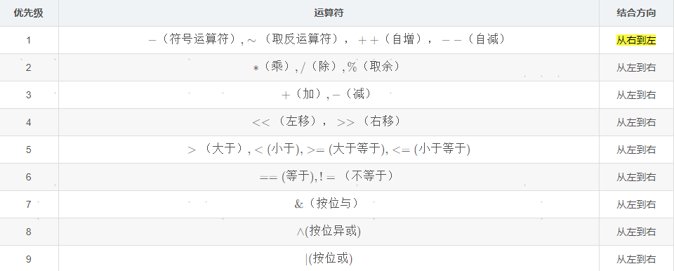
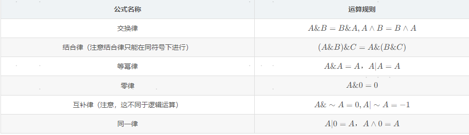
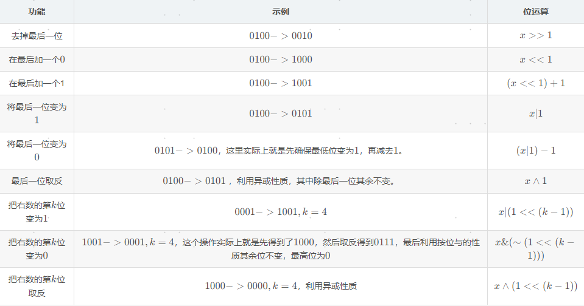
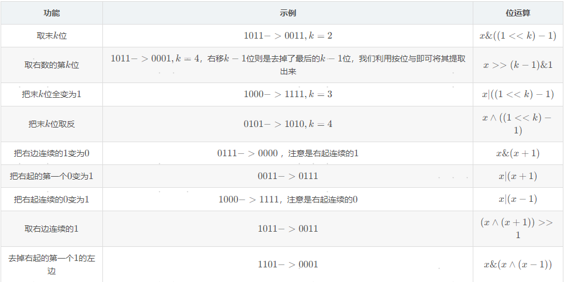

# 位运算

|符号|描述|运算规则|实例(四位二进制数为例)|
|---|---|---|---|
|&|与|两个位都为1时，结果才为1|0001&0001=1,0001&0000=0,0000&0000=0000|
|I|或|两个位都为0时，结果才为0|0001∣0001=0001,0001∣0000=0001,0000∣0000=0000|
|^|异或|两个位相同为0，相异为1|0001∧0001=0000,0001∧0000=1,0000∧0000=0|
|~|取反|0变1，1变0|∼0=1,∼1=0|
|<<|左移|各二进位全部左移若干位，高位丢弃，低位补0|0001<<k=0100，k=2，k kk是左移的位数，这里k = 2 k=2k=2|
|>>|右移|各二进位全部右移若干位，对无符号数，高位补0，有符号数，右移补1|0100>>k=0001，k=2，k kk是右移的位数，这里k = 2 k=2k=2|

## 位运算优先级

## 位运算符运算律

## 位运算符功能公式

